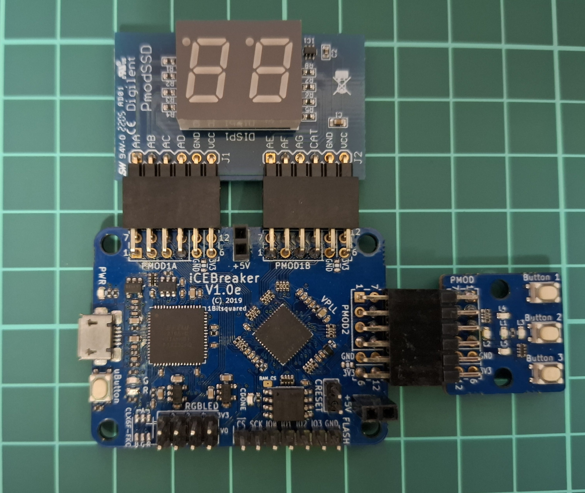
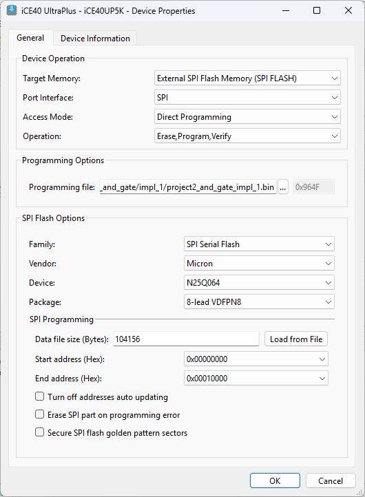

# Getting Started with FPGA

## About

This repository contains source code from the book *Getting Started with FPGAs* by Russell Merrick ([link](https://nandland.com/book-getting-started-with-fpga/)).

Only the Verilog parts of the book are implemented.

The code in this repository is meant to be used with the iCEBreaker FPGA v1.0e ([link](https://docs.icebreaker-fpga.org/hardware/icebreaker/))

This project uses the iCEBreaker switches and LEDs Pmod and the Digilent Seven-segment Pmod Display ([link](https://digilent.com/reference/pmod/pmodssd/start))

Code is implemented using Lattice Radiant, and the simulations are tested using QuestaSim.

## Contents

### Project 1: Switches to LEDs

Connect 4 switches to 4 LEDs. If you press a switch, the corresponding LED will turn on.

### Project 2: AND Gate

Connect 2 switches to 2 LEDs using an AND gate. If you press both switches, the LED will turn on.

### Project 3: LED Toggle

Connect a switch to an LED. If you press the switch, the LED will toggle on or off.

### Project 4: Debounce

An improvement of Project 3 by adding a switch debouncer.

### Project 5: Demux

A combination of a clock divider and a demultiplexer. We blink one of 4 LEDs selected using the demultiplexer.

## Simulations

### Simulation 1: AND Gate

Simulate the AND gate.

### Simulation 2: Debounce

Simulate the debouncer module.

### Simulation 3: State Machine

Simulate a state machine of a turnstile. The testbench includes assertions.

## How to Program the iCEBreaker v1.0e Board using Radiant Programmer

1. In the Radiant Programmer, right-click the device entry and open Device Properties.
2. In the Device Properties, change the Target Memory to `External SPI Flash Memory (SPI FLASH)`.
3. In the SPI Flash Options, change the vendor to `Micron`, the Device to `N25Q064`, and the package to `8-lead VDFPN8`, as shown in the image below.

Now you can program the iCEBreaker v1.0e board using Radiant Programmer.

